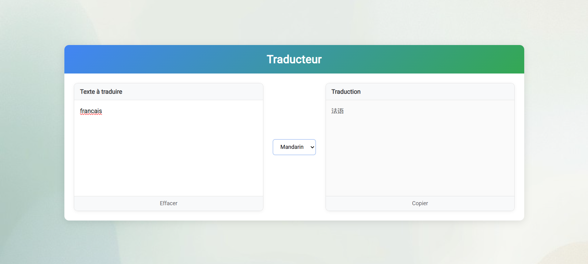

# Lingua Franca - Real-Time Translation Web Application

[](https://www.python.org/)
[](https://flask.palletsprojects.com/)
[](LICENSE)
=======


## Project Description

Lingua Franca is a professional translation web application built with Flask that provides real-time text translation using the DeepL API. The application features a clean, responsive interface with intelligent typing detection and supports multiple languages.

## Key Features

- Real-time translation with 500ms debounce delay
- Support for 5 languages: English, French, Spanish, Russian, and Mandarin
- Automatic language detection
- Clean, responsive UI with intuitive controls
- Copy to clipboard functionality
- AJAX implementation for seamless user experience

## Project Structure

```
lingua-franca/
├── README.md
├── app.py
├── requirements.txt
├── static/
│   ├── css/
│   │   └── main.css
│   └── img/
│       └── background_lingua.jpg
└── templates/
    └── index.html
```

## Technical Stack

- **Backend**: Python 3.8+, Flask 2.0+
- **Frontend**: HTML5, CSS3, JavaScript
- **Translation API**: DeepL (v2)
- **Environment Management**: Anaconda

## Requirements

```text
Flask==2.0.1
python-dotenv==1.0.0
requests==2.26.0
Werkzeug==2.0.1
```

## Installation

1. Clone the repository:
```bash
git clone https://github.com/yourusername/lingua-franca.git
cd lingua-franca
```

2. Create and activate conda environment:
```bash
conda create -n lingua-franca python=3.8
conda activate lingua-franca
```

3. Install dependencies:
```bash
pip install -r requirements.txt
```

4. Create `.env` file:
```env
DEEPL_API_KEY=your_api_key_here
```

5. Run the application:
```bash
python app.py
```

## Usage

1. Enter text in the source text area
2. Select target language from dropdown
3. Translation appears automatically
4. Use buttons to:
   - Copy translation to clipboard
   - Clear both text areas

## Deployment

For production deployment:

```bash
gunicorn --bind 0.0.0.0:5000 app:app
```

Or using Docker:

```bash
docker build -t lingua-franca .
docker run -p 5000:5000 lingua-franca
```

## License

<<<<<<< HEAD
This project is licensed under the MIT License. See [LICENSE](LICENSE) for details.
```
=======
This project is created as an academic assignment for La Plateforme's Bachelor program. 

---

*This project was developed as part of the curriculum for Bachelor 1st year at La Plateforme.*
>>>>>>> origin/develop
